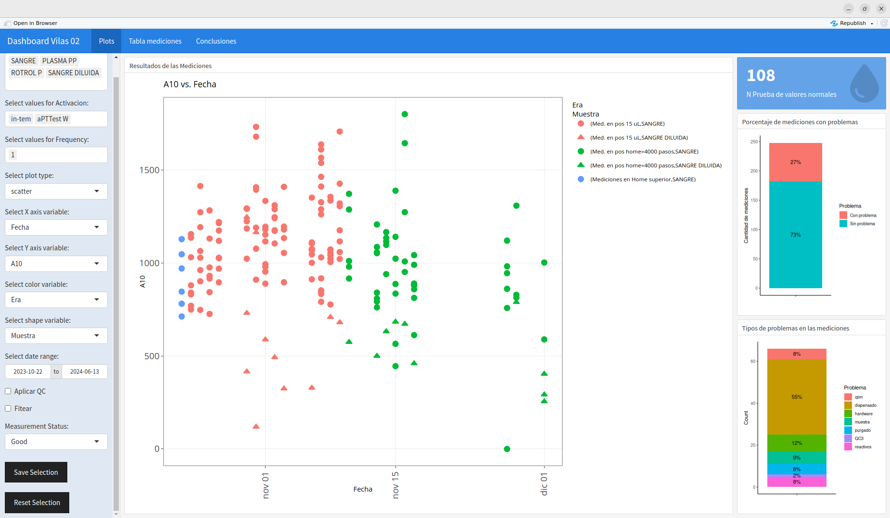

# dashboard_vilas02

This is a Shiny application written in R Markdown for creating a flexible dashboard to visualize and analyze data from a measurement log. This measurement log comes from extensive testing of the experimental VILAS coagulation analyzer device.

Overall, this application provides a comprehensive tool for visualizing, analyzing, and exploring the measurement log, with various filtering, plotting, and data processing capabilities. It also allows users to save and restore their configurations, making it easier to reproduce and share their analysis.

Online deployment of the dashboard:
http://darioantonio.shinyapps.io/dashboard_vilas02_1

Here's a summary of what the code does:

1. **Load required libraries**: The code loads several libraries such as `shiny`, `flexdashboard`, `dplyr`, `ggplot2`, `yaml`, `plotly`, and `MASS`.

2. **Load configuration**: The code loads a configuration file named `config.yml` using the `yaml` package.

3. **Load measurement data**: The code loads a measurement log either from a local file `mediciones_VILAS.rds` or from a Google Sheet, depending on the configuration settings.

4. **Data cleaning and processing**: The code performs extensive data cleaning and processing, including converting data types, creating new columns (e.g., `A10_mm`, `deltaCC`, `deltaTz`, `deltaPmed`, `A10corregido`, `A10_mm_corregido`), and filtering data based on various conditions.

5. **Assign 'Era' column**: The code assigns a column named 'Era' to the data based on specific 'Prueba' (test) values and corresponding era names from the configuration.

6. **Subset data**: The code creates various subsets of the data, such as `my_data_sin_problema` (measurements without any issues), `my_data_con_problema` (measurements with issues), and `my_data_QC` (measurements with quality checks applied).

7. **Define plotting functions**: The code defines several plotting functions (`my_plot`) to create scatter plots, box plots, histograms, and specialized plots like sigma vs. A (amplitude) plots.

8. **Shiny UI**: The code defines the user interface (UI) for the Shiny application, including input controls for selecting data subsets, plot types, variables for x, y, color, and shape, date range, and other options.

9. **Reactive data filtering**: The code defines reactive expressions to filter the data based on the user's selections in the UI.

10. **Render plots**: The code renders plots using the `renderPlotly` function, calling the appropriate plotting function based on the user's selections.

11. **Save and reset configurations**: The code includes event observers to save the user's selections to the `config.yml` file and reset the UI to the initial configuration settings.

12. **Display value boxes and plots**: The code displays value boxes showing the number of unique values for a specific test (e.g., "PVN") and plots showing the percentage of measurements with problems and the types of problems encountered.

13. **Render data table**: The code renders a data table using `DT::renderDT` to display the measurement data.

14. **Display conclusions and observations**: The code includes markdown sections to display conclusions, observations, and a timeline of events related to the measurement process.

 

